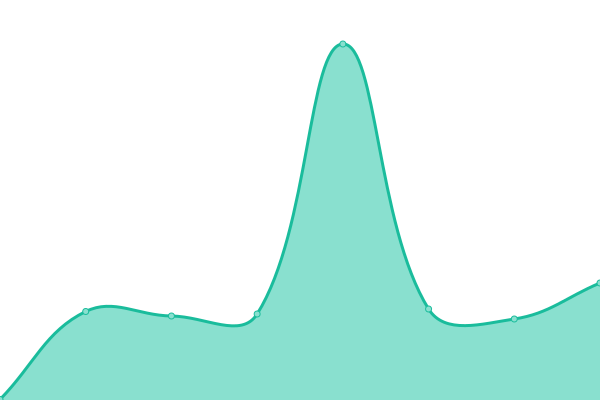

# 

[AMPnet status page](https://status.ampnet.io) is the open-source uptime monitor and status page, powered entirely by GitHub Actions and Issues.
Created from template [Upptime](https://github.com/upptime/upptime).

<!--start: status pages-->
<!-- This summary is generated by Upptime (https://github.com/upptime/upptime) -->
<!-- Do not edit this manually, your changes will be overwritten -->
<!-- prettier-ignore -->
| URL | Status | History | Response Time | Uptime |
| --- | ------ | ------- | ------------- | ------ |
|  [AMPnet](https://ampnet.io) | 🟩 Up | [am-pnet.yml](https://github.com/AMPnet/status/commits/HEAD/history/am-pnet.yml) | 

 574ms
     
 | 

<a href="https://status.ampnet.io/history/am-pnet">100.00%</a>
    

|  [Genervest](https://genervest.ampnet.io) | 🟩 Up | [genervest.yml](https://github.com/AMPnet/status/commits/HEAD/history/genervest.yml) | 

 219ms
     
 | 

<a href="https://status.ampnet.io/history/genervest">100.00%</a>
    

|  [App](https://invest.ampnet.io) | 🟩 Up | [app.yml](https://github.com/AMPnet/status/commits/HEAD/history/app.yml) | 

 484ms
     
 | 

<a href="https://status.ampnet.io/history/app">100.00%</a>
    

|  [Staging](https://staging.ampnet.io) | 🟩 Up | [staging.yml](https://github.com/AMPnet/status/commits/HEAD/history/staging.yml) | 

 700ms
     
 | 

<a href="https://status.ampnet.io/history/staging">100.00%</a>
    

|  [Invest API](https://invest-api.ampnet.io/monitoring/prometheus/targets) | 🟩 Up | [invest-api.yml](https://github.com/AMPnet/status/commits/HEAD/history/invest-api.yml) | 

 166ms
     
 | 

<a href="https://status.ampnet.io/history/invest-api">100.00%</a>
    

|  [Staging API](https://eth-staging.ampnet.io/monitoring/prometheus/targets) | 🟩 Up | [staging-api.yml](https://github.com/AMPnet/status/commits/HEAD/history/staging-api.yml) | 

 182ms
     
 | 

<a href="https://status.ampnet.io/history/staging-api">100.00%</a>
    

|  [Blog](https://blog.ampnet.io) | 🟩 Up | [blog.yml](https://github.com/AMPnet/status/commits/HEAD/history/blog.yml) | 

 236ms
     
 | 

<a href="https://status.ampnet.io/history/blog">100.00%</a>
    

<!--end: status pages-->
